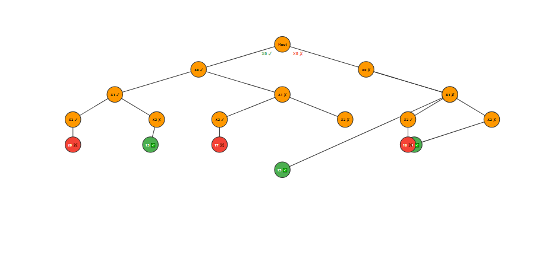

# 🔙 Backtracking Notes

## Introduction
Backtracking is a **recursive algorithmic technique** for solving problems incrementally.  
It works by exploring possible partial solutions and abandoning (backtracking) if they fail to satisfy constraints.

👉 Think of it as **exploring all possibilities, but pruning wrong paths early**.

---

## Key Idea
- Try a choice → Check validity → Continue if valid → Else undo (backtrack).
- Like exploring all paths in a maze: if you hit a wall, you **go back** and try another path.

---

## When to Use Backtracking?
✔️ When you need to explore **all combinations/permutations/subsets**.  
✔️ When there’s a **clear way to validate partial solutions**.  
✔️ When the **number of combinations is huge**, so brute force is too expensive.  
✔️ When recursion alone is not enough — backtracking makes recursion **smarter** by pruning invalid paths.  

---

## Example Problem
**Find a combination from `[2, 3, 5, 10, 12]` that sums to 15.**

Steps:
1. Label numbers as x₀ = 2, x₁ = 3, x₂ = 5, x₃ = 10, x₄ = 12.  
2. Initialize `sum = 0`.  
3. At each step, decide: **include number or skip it**.  
4. Explore recursively (this builds a **state space tree**).  
5. If `sum == 15 → valid solution`. If `sum > 15 → backtrack`.  

👉 Maximum number of decisions for `n` elements = **2ⁿ** (include or exclude).  

---

## State Space Tree for Target Sum = 15

Below is the **state space tree** generated for this problem.  
Green nodes ✅ represent **valid solutions**.
Red nodes ❌ represent **invalid paths** (sum exceeded 15).
Root: (Sum=0, Path=[])

├── Include 2 → (Sum=2, Path=[2])
│   ├── Include 3 → (Sum=5, Path=[2,3])
│   │   ├── Include 5 → (Sum=10, Path=[2,3,5])
│   │   │   ├── Include 10 → (Sum=20 ❌)
│   │   │   └── Exclude 10 → (Sum=10, Path=[2,3,5])
│   │   │       ├── Include 12 → (Sum=22 ❌)
│   │   │       └── Exclude 12 → (Sum=10, Path=[2,3,5])
│   │   └── Exclude 5 → (Sum=5, Path=[2,3])
│   │       ├── Include 10 → (Sum=15 ✅ Path=[2,3,10])
│   │       └── Exclude 10 → (Sum=5, Path=[2,3])
│   │           ├── Include 12 → (Sum=17 ❌)
│   │           └── Exclude 12 → (Sum=5, Path=[2,3])
│   └── Exclude 3 → (Sum=2, Path=[2])
│       ├── Include 5 → (Sum=7, Path=[2,5])
│       │   ├── Include 10 → (Sum=17 ❌)
│       │   └── Exclude 10 → (Sum=7, Path=[2,5])
│       │       ├── Include 12 → (Sum=19 ❌)
│       │       └── Exclude 12 → (Sum=7, Path=[2,5])
│       └── Exclude 5 → (Sum=2, Path=[2])
│           ├── Include 10 → (Sum=12, Path=[2,10])
│           │   ├── Include 12 → (Sum=24 ❌)
│           │   └── Exclude 12 → (Sum=12, Path=[2,10])
│           └── Exclude 10 → (Sum=2, Path=[2])
│               ├── Include 12 → (Sum=14, Path=[2,12])
│               └── Exclude 12 → (Sum=2, Path=[2])

└── Exclude 2 → (Sum=0, Path=[])
    ├── Include 3 → (Sum=3, Path=[3])
    │   ├── Include 5 → (Sum=8, Path=[3,5])
    │   │   ├── Include 10 → (Sum=18 ❌)
    │   │   └── Exclude 10 → (Sum=8, Path=[3,5])
    │   │       ├── Include 12 → (Sum=20 ❌)
    │   │       └── Exclude 12 → (Sum=8, Path=[3,5])
    │   └── Exclude 5 → (Sum=3, Path=[3])
    │       ├── Include 10 → (Sum=13, Path=[3,10])
    │       │   ├── Include 12 → (Sum=25 ❌)
    │       │   └── Exclude 12 → (Sum=13, Path=[3,10])
    │       └── Exclude 10 → (Sum=3, Path=[3])
    │           ├── Include 12 → (Sum=15 ✅ Path=[3,12])
    │           └── Exclude 12 → (Sum=3, Path=[3])
    └── Exclude 3 → (Sum=0, Path=[])
        ├── Include 5 → (Sum=5, Path=[5])
        │   ├── Include 10 → (Sum=15 ✅ Path=[5,10])
        │   └── Exclude 10 → (Sum=5, Path=[5])
        │       ├── Include 12 → (Sum=17 ❌)
        │       └── Exclude 12 → (Sum=5, Path=[5])
        └── Exclude 5 → (Sum=0, Path=[])
            ├── Include 10 → (Sum=10, Path=[10])
            │   ├── Include 12 → (Sum=22 ❌)
            │   └── Exclude 12 → (Sum=10, Path=[10])
            └── Exclude 10 → (Sum=0, Path=[])
                ├── Include 12 → (Sum=12, Path=[12])
                └── Exclude 12 → (Sum=0, Path=[])

---

## Common Use Cases
- ✅ Subsets  
- ✅ Combinations  
- ✅ Permutations  
- ✅ N-Queens Problem  
- ✅ Sudoku Solver  
- ✅ Word Search / Maze Problems  

---

✨ **In short:**  
Backtracking = **Recursion + Smart Undoing**  
It explores everything like brute force but avoids wasting time on invalid paths.

